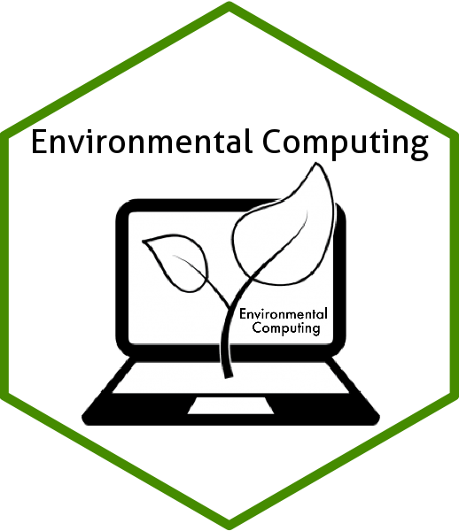

<!-- README.md is generated from README.Rmd. Please edit that file -->

# Bienvenido a Environmental Computing 👋

<!-- badges: start -->

<!-- badges: end -->

El objetivo de **Environmental Computing** es proporcionar tutoriales
accesibles de codificación y estadística para usuarios de R. Si deseas
obtener más información sobre este sitio, haz clic
[aquí](https://environmentalcomputingsp.netlify.app/about/).
